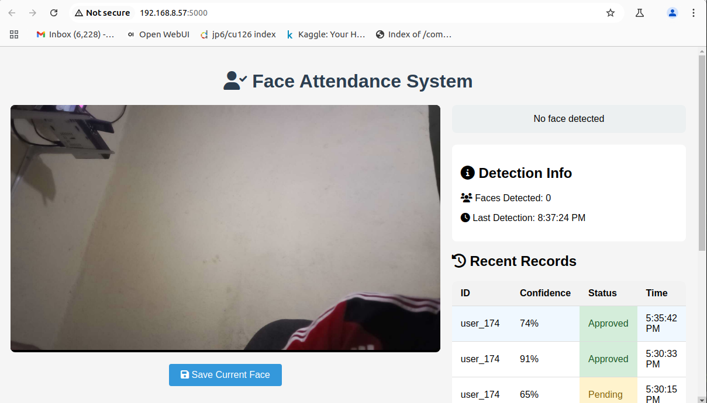
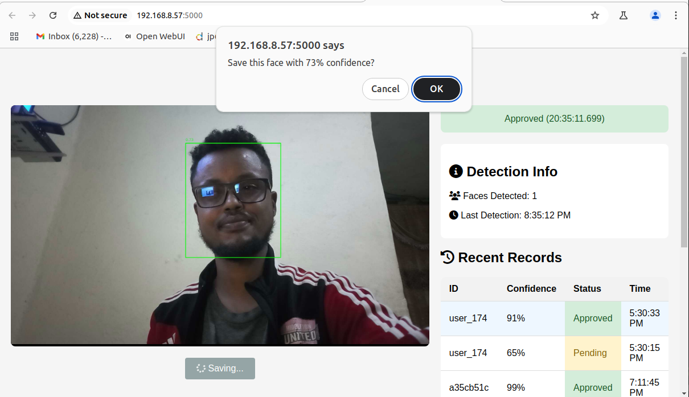

# face_detection_attendance_system
**Face Attendance System** detects faces via _IP-camera_ using Nvidia Jetson Orin Nano 8GB Devkit, logs attendance with confidence scoring, and stores records in _SQLite_. Built with Python (_Flask + OpenCV_), it features real-time web viewing with detection overlays and manual save capability for workplace/classroom tracking.

**Face Attendance System** is a real-time face detection and attendance tracking solution that leverages IP camera feeds to automatically record and manage attendance entries. Built with Python (Flask backend) and OpenCV for face detection, the system processes live video streams, detects faces with confidence scoring, and logs attendance entries into an _SQLite database_. The web interface provides a live video feed with detection overlays, real-time status updates, and manual saving of detected faces. Designed for environments requiring automated attendance tracking, such as workplaces or classrooms, this system offers a simple yet effective way to monitor presence while maintaining records with timestamps and confidence-based approval status. Future enhancements can include face recognition, multi-camera support, and reporting features.

Face Attendance System with IP Camera Integration
A real-time face detection and attendance tracking system that uses IP camera feeds to automatically record and manage attendance with confidence-based verification.

## Key Features
### Project Structure

└── face-attendance-system/

    ├── app.py
    
    ├── face_detection.py
    
    ├── models/
    
    │   ├── deploy.prototxt
    
    │   └── res10_...caffemodel
    
    ├── templates/
    
    │   └── attendance_ui.html
    
    ├── static/
    
    │   ├── styles.css
    
    │   └── script.js
    
    ├── attendance.db
    
    ├── requirements.txt
    
    └── README.md
    
### 📷 Real-time Face Detection

  OpenCV-based face detection with confidence scoring

  IP camera integration for remote monitoring

  Visual bounding boxes and confidence indicators

### 🏠 UI Demo

1. First look:

2. Face detection:

3. Face Detected and Registering to DB:

4. Face Detected and Registering to DB:

5. Detected Face Registered:

 

### 📊 Attendance Management

  ✅ Automatic attendance recording with timestamps

  ✅ Confidence-based status (Approved/Pending)

  ✅ Recent records display with highlighting

  ✅ Database persistence using SQLite

### 🔄 Smart Saving

  Manual save button with confirmation

  Confidence threshold filtering (70%+ for auto-approval)

  Visual feedback during save operations

### 🌐 Web Interface

  Live video feed with detection overlay

  Real-time status updates

  Responsive design for various devices

  Simple REST API for integration

## Technology Stack
  ✔ Backend: Python (Flask)

  ✔ Face Detection: OpenCV DNN with Caffe model

  ✔ Frontend: HTML5, CSS3, JavaScript

  ✔ Database: SQLite

  ✔ Networking: IP Camera Stream (MJPEG)

## Use Cases
  ✔ Employee attendance tracking

  ✔ Classroom management

  ✔ Secure access control

  ✔ Time and attendance automation

## Setup Instructions

  1. Install dependencies: pip install -r requirements.txt

  2. Configure your IP camera URL in app.py

  3. Run the application: python app.py

  4. Access the web interface at http://localhost:5000

## Future Enhancements

   ✔ Face recognition (vs just detection)

   ✔ Multi-camera support

   ✔ Export attendance reports

   ✔ Mobile app integration

   ✔ Advanced analytics dashboard
